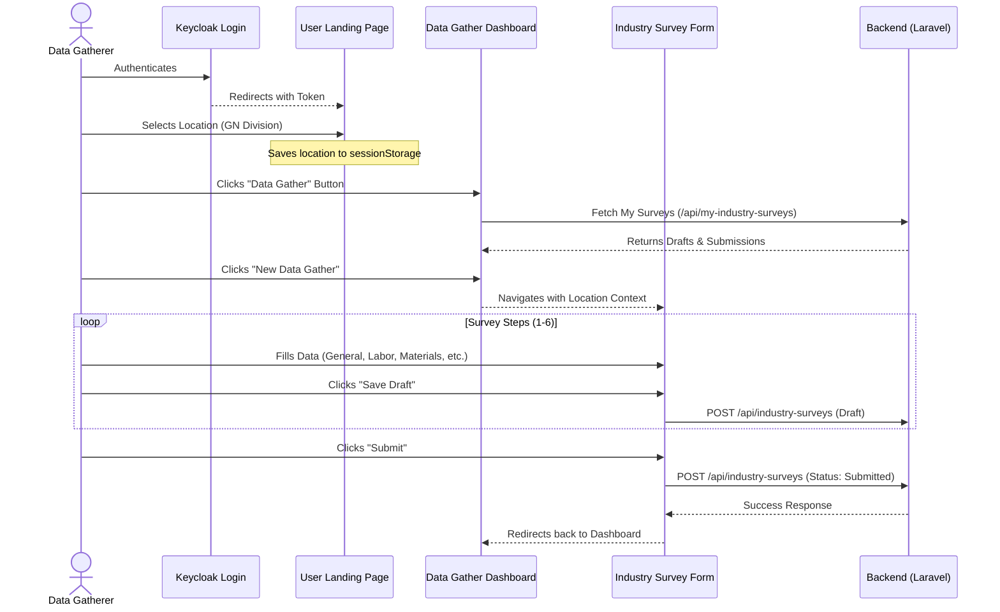
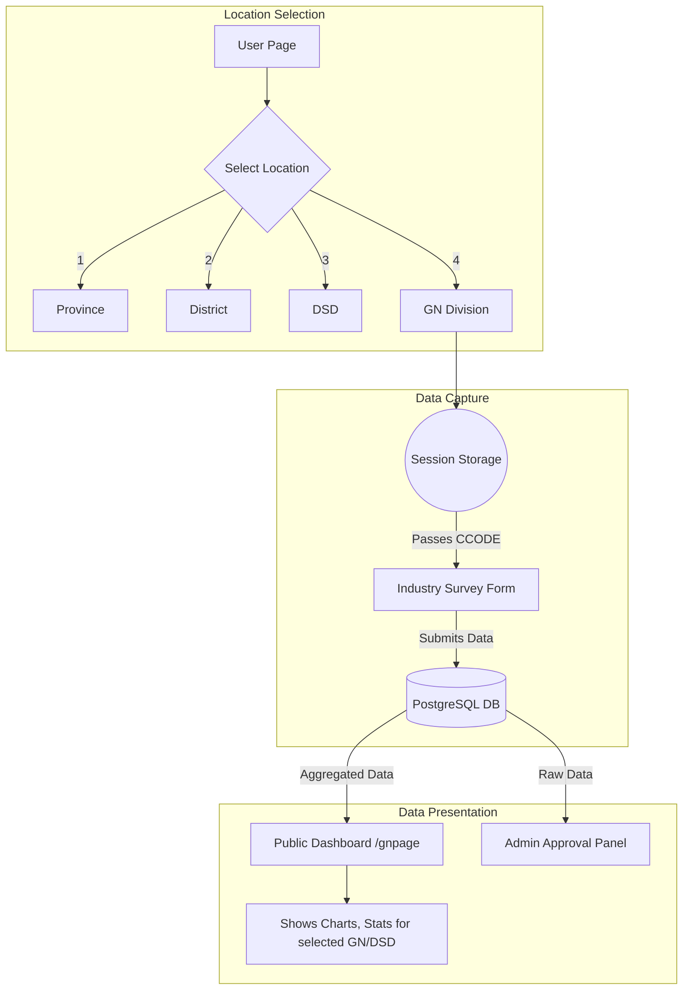
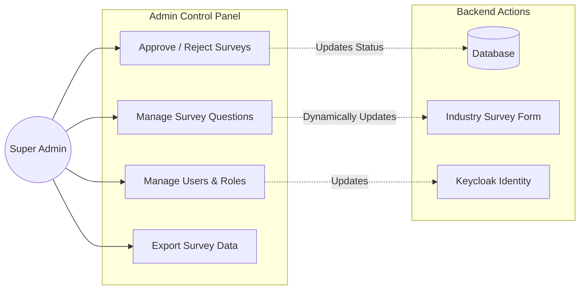

# Industry Survey Flow & Architecture

The following diagrams illustrate how different users (Data Gatherers and Super Admins) interact with the Industry Survey system, and how location data flows through the application.

## 1. User Interaction Flow (Data Gatherer)

This diagram shows the step-by-step journey of a Data Gatherer submitting an Industry Survey.

## 2. Location & Data Flow Diagram

This flowchart illustrates how the location hierarchy is selected and how data is distributed across the platform based on that location.

## 3. Super Admin Interaction

This diagram shows how a Super Admin governs the Industry Survey module, manages submissions, and configures questions.

