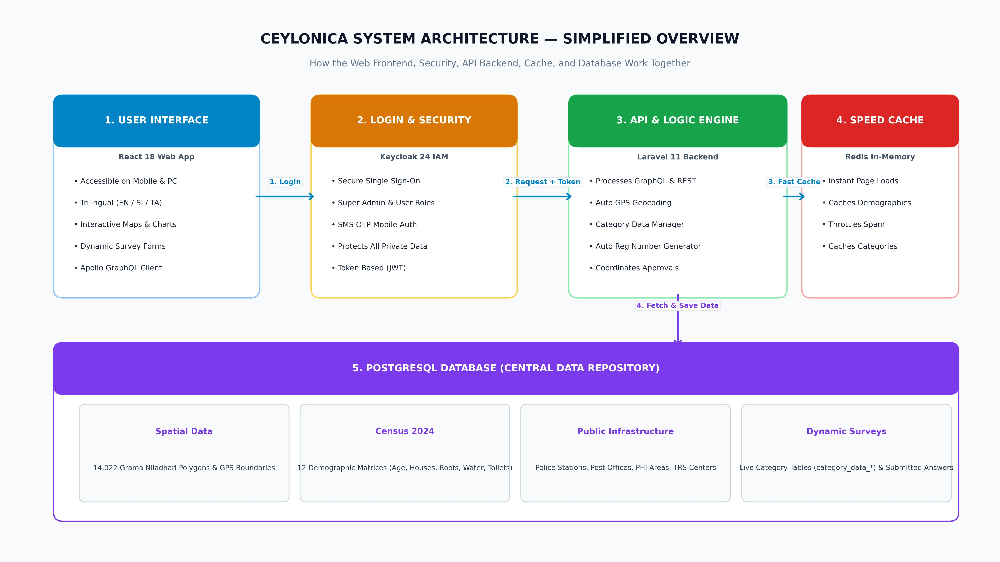
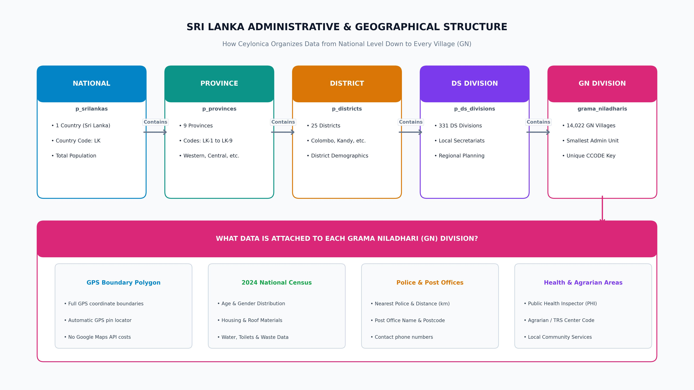
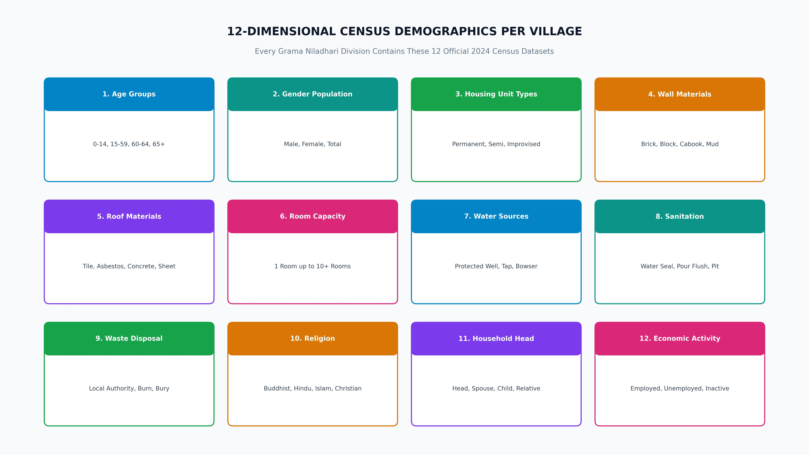
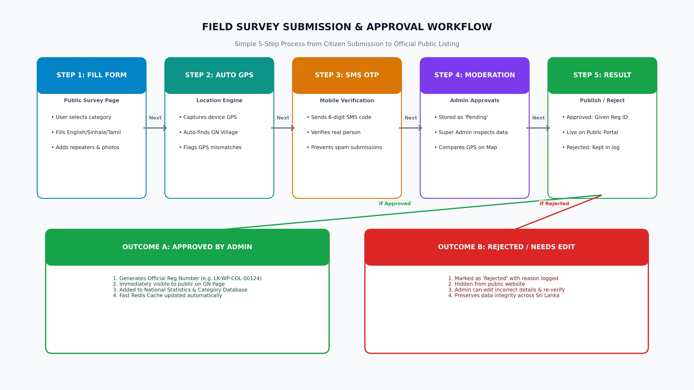
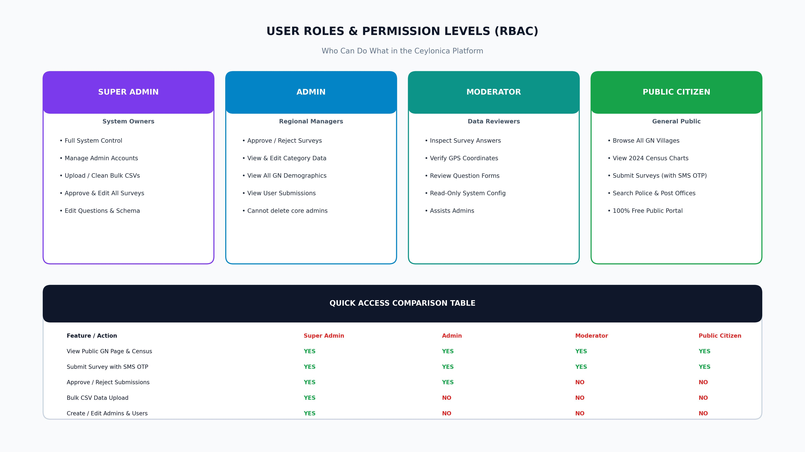

# Ceylonica Platform — Complete System Architecture & Operations Manual

**Document Version:** `2.4.0 (Production Release)`  
**Platform Scope:** Sri Lanka National GIS, 2024 Census & Dynamic Field Survey Platform  
**Target Audience:** Developers, System Administrators, Survey Officers & Project Stakeholders  
**Tech Stack:** React 18 (TypeScript) | Laravel 11 (PHP 8.2) | Lighthouse GraphQL | PostgreSQL 16 | Keycloak 24 IAM | Redis Alpine | Docker

---

## 1. What is Ceylonica? (In Simple Terms)

**Ceylonica** is a web-based national data portal and field surveying system built specifically for Sri Lanka.

It provides three core solutions in one easy-to-use platform:

```
+-----------------------------------------------------------------------------------+
|                                CEYLONICA PLATFORM                                 |
+-------------------------+-------------------------+-------------------------------+
|  1. NATIONAL CENSUS     |  2. DYNAMIC SURVEYS     |  3. CIVIC INFRASTRUCTURE      |
|  Look up 2024 Census    |  Collect trilingual     |  Map nearest police stations, |
|  demographics for any   |  surveys on mobile      |  post offices, PHI areas, and |
|  of 14,022 GN villages. |  with GPS & SMS OTP.    |  TRS centers with distances.  |
+-------------------------+-------------------------+-------------------------------+
```

### The 3 Core Functions:
1. **Explore Sri Lanka's Demographics:** Anyone can browse through any of the 14,022 Grama Niladhari (GN) divisions in Sri Lanka to see 2024 Census data (population by age and gender, house types, roof materials, drinking water sources, toilet facilities, waste disposal, and religions).
2. **Collect Field Survey Data:** Administrators can create customized trilingual survey forms (English, Sinhala, Tamil). Citizens and field staff can submit business information with automatic GPS location tagging and mobile SMS OTP verification.
3. **Public Infrastructure Mapping:** Connects every village with its nearest Police Station (including distance in km), Post Office (with postal code), Public Health Inspector (PHI) territory, and Agrarian (TRS) service area.

---

## 2. Big Picture: How the Whole System Works

Below is the clean system overview showing how the web app, security, backend API, cache, and database work together:



### What each part does:

| Component | Technology | Plain English Explanation |
|---|---|---|
| **1. Web App (Frontend)** | React 18 + TypeScript + Vite | The interactive website that users see on their phones or laptops. Uses Material-UI for modern cards, tables, and buttons, and Leaflet for interactive GIS maps. |
| **2. Login & Security** | Keycloak 24.0.3 (IAM) | Handles user sign-in and passwords securely. Gives users the right permissions (Super Admin, Admin, Moderator, Public Citizen). |
| **3. API & Backend Engine** | Laravel 11 (PHP 8.2) | The central brain of the platform. Processes GraphQL queries, verifies GPS boundaries, saves survey answers, and generates official registration numbers. |
| **4. High-Speed Cache** | Redis Alpine | Stores frequently requested census and category data in high-speed RAM so pages load in milliseconds. |
| **5. Central Database** | PostgreSQL 16 | The master database storing all 14,022 GN divisions, 12 census demographic tables, survey responses, and infrastructure records. |
| **6. SMS OTP Gateway** | Textware SMS API | Sends 6-digit verification codes to citizens' phones when submitting surveys to prevent spam. |

---

## 3. Sri Lanka Administrative & Geographical Structure

Sri Lanka is divided into 4 official administrative tiers. Ceylonica models all four tiers with 100% accuracy:



### The 4 Administrative Levels:
1. **National Level (`p_srilankas`):** 1 Country (Sri Lanka, Code: `LK`).
2. **Province Level (`p_provinces`):** 9 Provinces (Western, Central, Southern, Northern, Eastern, North Western, North Central, Uva, Sabaragamuwa). Codes: `LK-1` to `LK-9`.
3. **District Level (`p_districts`):** 25 Districts (Colombo, Gampaha, Kandy, Galle, etc.). Codes: `LK-11` to `LK-92`.
4. **Divisional Secretariat (`p_ds_divisions`):** 331 DS Divisions (Local Secretariats).
5. **Grama Niladhari Division (`grama_niladharis`):** 14,022 GN Villages (The smallest administrative unit in Sri Lanka, identified by a unique `CCODE`).

### What is Attached to Every GN Village:
* **Spatial Polygon Boundary:** The exact GPS boundary lines of the village.
* **2024 National Census Demographics:** 12 demographic tables (Age, Gender, Housing, Water, Sanitation, Religion, etc.).
* **Police Jurisdiction:** Nearest police station name, contact details, and road distance in kilometers.
* **Postal Network:** Post office name, post code, and latitude/longitude.
* **Public Health Inspector (PHI):** Health inspection division code.
* **Agrarian Services (TRS):** Agrarian service center code.

---

## 4. Automatic GPS Geolocation (No Google Maps API Fees)

When a citizen or field worker opens a survey on their smartphone and taps **"Use My Location"**, Ceylonica automatically detects their exact Grama Niladhari village without paying external map fees:

```
[Phone GPS: Lat, Lng]
        │
        ▼
[Step 1: Bounding Box Filter] ────► Reduces 14,022 villages to 1-3 candidates in 2ms
        │
        ▼
[Step 2: Ray-Casting Polygon Check] ─► Counts border crossings mathematically
        │
        ▼
[Verified Village Found!] ──────────► Auto-fills: Village Name, DS Division, District & Province
```

If a user manually selects "Colombo" but their device GPS says they are in "Kandy", the system flags the submission with `coordinate_mismatch = true` so administrators can review it.

---

## 5. The 12 Census Demographic Datasets

Every Grama Niladhari division in Ceylonica includes official **2024 Census of Population and Housing** statistics:



| # | Demographic Category | Database Table | Key Attributes Tracked |
|---|---|---|---|
| **1** | **Age Distribution** | `p_gns` | Children (0-14), Working age (15-59), Pre-seniors (60-64), Seniors (65+). |
| **2** | **Gender Profile** | `p_gns` | Male population, Female population, Total both genders. |
| **3** | **Housing Unit Types** | `housing_unit_types` | Permanent housing, Semi-Permanent housing, Improvised/temporary shacks. |
| **4** | **Wall Construction Materials** | `housing_wall_types` | Brick, Cement block/stone, Cabook, Soil bricks, Mud walls, Cadjan/plank. |
| **5** | **Roof Construction Materials** | `housing_roof_types` | Tile, Asbestos, Concrete slab, Zinc/Aluminium sheet, Metal sheet, Straw. |
| **6** | **Room Capacity per House** | `rooms_in_housing_units` | Count of units with 1 room, 2, 3, 4, 5, 6, 7, 8, 9, or 10+ rooms. |
| **7** | **Drinking Water Sources** | `drinking_water_sources` | Protected well (inside/outside), Tap water, Rural water projects, Bowser, River. |
| **8** | **Sanitation Facilities** | `toilet_facilities` | Water seal (sewer/septic tank), Pour flush, Direct pit, Not using. |
| **9** | **Solid Waste Disposal** | `solid_waste_disposals` | Local authority collection, Burned, Buried, Composting, Dumped to environment. |
| **10**| **Religious Affiliations** | `religious_affiliations`| Buddhist, Hindu, Islam, Roman Catholic, Other Christian, Other. |
| **11**| **Household Head Relationships** | `household_head_relationships`| Head, Spouse, Son/Daughter, In-law, Grandchild, Parent, Boarder, Employee. |
| **12**| **Economic Activity** | `gn_economies` | Employed workers, Unemployed job seekers, Economically not active population. |

---

## 6. Field Survey Submission & Approval Workflow

Ceylonica provides a complete submission lifecycle that ensures data accuracy, eliminates spam, and issues official registration numbers:



### The 5-Step Submission Process:
1. **Fill Survey:** User opens `/industry-survey`, selects a category, and enters business details in English, Sinhala, or Tamil.
2. **GPS Tagging:** Device coordinates are captured. The system automatically verifies the Grama Niladhari division.
3. **SMS OTP Verification:** A 6-digit code is dispatched to the user's mobile phone via Textware SMS Gateway.
4. **Admin Moderation:** The record is saved as `pending`. Super Admins inspect the record on `/approvals`, check the map pin, and compare submitted vs. database data.
5. **Approval & Reg ID:** Upon approval:
   * System generates an official code (e.g. `LK-WP-COL-00124`).
   * Record immediately goes live on the public `/gnpage`.
   * Redis cache is cleared so visitors see updated statistics instantly.

---

## 7. User Roles & Security (Who Can Do What)

Access to platform features is governed by Role-Based Access Control (RBAC):



| Action / Feature | Super Admin | Admin | Moderator | Public Citizen |
|---|---|---|---|---|
| Browse Public GN Portal & Demographics | Yes | Yes | Yes | Yes (Free) |
| Submit New Surveys | Yes | Yes | Yes | Yes (with SMS OTP) |
| Approve / Reject Field Submissions | Yes | Yes | No | No |
| Bulk CSV Upload & Table Management | Yes | No | No | No |
| Create / Manage Admin Accounts | Yes | No | No | No |
| Configure Survey Questions | Yes | Yes | No | No |

---

## 8. Frontend Navigation Guide (All Screens Explained)

| Route | Page Component | What it does |
|---|---|---|
| `/gnpage` | `DashboardPage.tsx` | Main public map & village explorer. Search any GN, view demographic charts, weather, police, and post offices. |
| `/gnpage/:gnName/:ccode` | `DashboardPage.tsx` | Direct permalink to a specific Grama Niladhari village. |
| `/industry-survey` | `IndustrySurveyPage.tsx` | Public dynamic trilingual survey submission form with mobile OTP. |
| `/approvals` | `ApprovalsPage.tsx` | Admin review console for inspecting, approving, or rejecting field submissions. |
| `/categories` | `CategoriesPage.tsx` | Category tree manager for organizing business sectors and dynamic tables. |
| `/admin/industry-survey-questions` | `AdminIndustrySurveysQuestions.tsx` | Form builder for adding new survey questions in English, Sinhala, and Tamil. |
| `/bulk-data` | `BulkDataPage.tsx` | Super Admin tool for uploading large CSV datasets with automatic schema creation. |
| `/admins` | `AdminsPage.tsx` | User management screen for assigning roles and viewing system administrators. |
| `/police-connections` | `PoliceConnectionsPage.tsx` | Mappings between police stations and GN divisions. |
| `/post-office-connections` | `PostOfficeConnectionsPage.tsx` | Mappings between post offices, postal codes, and GN divisions. |

---

## 9. Operations, Installation & How to Run

### Step 1: Start All Docker Services
```powershell
cd "c:\xampp\htdocs\Celonica Quecion web"
docker compose up -d
```
*Wait ~60 seconds for Keycloak, PostgreSQL, Redis, and Laravel containers to initialize.*

### Step 2: Run Database Migrations & National Seeders
```powershell
cd "c:\xampp\htdocs\Celonica Quecion web\backend"
php artisan migrate
php artisan db:seed
php artisan db:seed --class=AdminSeeder
```

### Step 3: Default Service Ports & Logins

| Service | URL | Login / Notes |
|---|---|---|
| **React Web App** | `http://localhost:5173` (or `http://localhost:3001`) | Public / Admin Portal |
| **Laravel GraphQL API** | `http://localhost:8000/graphql` | GraphQL Playground |
| **Keycloak Admin** | `http://localhost:8080/admin` (or `8081`) | `admin` / `admin123` (Realm: `ceylonica-admin`) |
| **PostgreSQL Database** | `localhost:5432` (or `5434`) | `celonica_user` / `celonica_pass` (DB: `celonica_db`) |
| **Redis Cache** | `localhost:6379` | High-speed cache |

---

## 10. Generated Files & Assets

* **Official PDF Project Manual:** [CEYLONICA_COMPLETE_PROJECT_MANUAL_AND_ARCHITECTURE_DOCUMENTATION.pdf](file:///C:/xampp/htdocs/Celonica%20Quecion%20web/CEYLONICA_COMPLETE_PROJECT_MANUAL_AND_ARCHITECTURE_DOCUMENTATION.pdf)
* **High-Resolution Visual Diagrams:**
  1. [1_system_architecture_topology.jpg](file:///C:/xampp/htdocs/Celonica%20Quecion%20web/docs/diagrams/1_system_architecture_topology.jpg)
  2. [2_spatial_administrative_hierarchy.jpg](file:///C:/xampp/htdocs/Celonica%20Quecion%20web/docs/diagrams/2_spatial_administrative_hierarchy.jpg)
  3. [3_survey_and_category_lifecycle.jpg](file:///C:/xampp/htdocs/Celonica%20Quecion%20web/docs/diagrams/3_survey_and_category_lifecycle.jpg)
  4. [4_auth_security_flow.jpg](file:///C:/xampp/htdocs/Celonica%20Quecion%20web/docs/diagrams/4_auth_security_flow.jpg)
  5. [5_demographic_census_matrix.jpg](file:///C:/xampp/htdocs/Celonica%20Quecion%20web/docs/diagrams/5_demographic_census_matrix.jpg)
